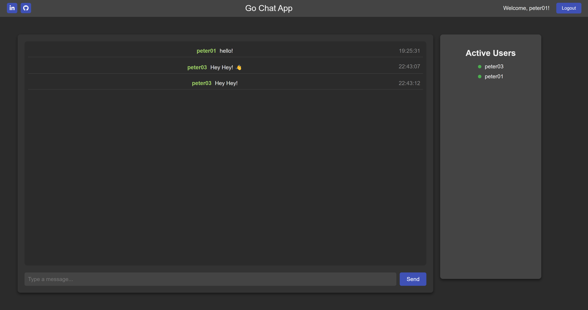

# Project Overview

This is an **instant messaging chat app** made to practice and expand my full-stack development abilities. It was built with a **Go** backend, a **React** frontend, and a **MySQL** database and all containerized using **Docker Compose** for repeatable and easy deployment.

I've taken time to implement from scratch advanced patterns like **dependency injection** and **Interface-Based Polymorphism** for modularity, scalability, and ease of testing. I also investigated and implemented security measures such as **session management**, **CSRF tokens**, and custom **CORS middleware**. The project is complete with some examples of testing practices such as mock services and unit tests for demonstration of best practices in Go.

# Features

### Backend (Go)

- WebSockets for Real-Time chat and active user information.
- **Security Best Practices**:
  - Session Management and CSRF Protection implemented from scratch for better understanding.
  - Custom CORS Middleware to handle cross-origin requests.
- **Architecture**:
  - Dependency Injection and Interface-Based Polymorphism for services (database and authentication), allowing easy testing with mock implementations.
  - Use of Go channels to broadcast messages to notify active users in real time.
- **Database Integration:**
  - MySQL for user authentication and message persistence.
  - Mock database implementations for unit testing.
- **Testing:**
  - Demonstration unit tests and mocking for database and authentication code.

### Frontend (React)

- Built with React Javascript/Typescript. Was good practice although not the focus of this project.
- Frontend communicates with the backend WebSocket API and REST endpoints.

### Database (MySQL)

- Used MySQL for practising implementing SQL (despite it being overkill for this project).

### DevOps

- Containerized using **Docker Compose** for easy consistent deployments.
- **CI/CD Github Action** pipeline for running unit tests, and building and pushing docker images.

### Tools

- **Postman**: API testing during development.
- **Git**: Version control for codebase management.

# Motivation

This project was built as a learning exercise while teaching myself **Go** and exploring full-stack development and best practices for web development.

There are lots of good Go web frameworks such a Gin that handle some of the stuff implemented however the aim was to practice and learn the core concepts. After this I will be better equipped to use frameworks in future now I better understand the underlying mechanics.

# Screenshots

<p align="center">
  
</p>
<p align="center">
  
</p>
<p align="center">
  
  <p align="center"> When a user is logged out they cant connect to the websocket </p> 
</p>

# Project Structure (Less Important Bits Omitted)

```
chat-app/
├── backend/
│   ├── main.go          # Entry point for the Go server
│   ├── auth/            # Authentication logic
│   │   ├── auth.go      # Functions like Register, LoginUser and utilities for password hashing and token generation
│   │   └── auth_test.go # Unit tests for authentication functions
|   |
│   ├── broadcast/       # Handles broadcasting and notification of chat messages and active user updates
│   │   └── broadcast.go
│   ├── db/                 # Database logic and mock implementations
│   │   ├── db.go           # Functions for live MySQL database interactions (e.g., SaveMessage, GetChatHistory)
│   │   ├── db_mock.go      # Mock database implementation for testing
│   │   └── db_mock_test.go # Tests for mock database functions
|   |
│   ├── handlers/        # Request handlers for handling connections and chat history requests
│   │   └── handlers.go
│   ├── middleware/      # Custom CORS middleware to handle cross-origin requests
│   │   └── middleware.go
│   ├── models/          # Defines the data models used in the app
│   │   └── models.go
│   ├── routes/          # API route setup
│   │   └── routes.go
│   ├── services/        # Service initializations
│   │   └── services.go
│   └── utils/           # Utility functions like GetBroadcastChannel and RegisterClient
│       └── utils.go
├── frontend/
│   ├── src/
│   │   ├── App.tsx      # Main React entry point
│   │   └── Chat.tsx     # Chat component
│   │   └── TopBar.tsx   # Topbar component
│   │   ├── ....         # Other frontend bits
├── db/
│   ├── init.sql/        # Database initialisation config
├── docker-compose.yml   # Containerization configuration
└── .env                 # Example environment variables

```

# Explanation of Technical Concepts

## Object-Oriented Programming Principles and Design Patterns in Go

While Go is not a pure Object-Oriented Programming language, it does support features that allow an OOP-like design approach. Go doesn't have classes or class-based inheritance, it also doesn't allow method overloading. Despite this, we can achieve similar results using Go’s pragmatic approach to programming.

### Composition-Based Design:

Instead of classes, we can use **structs** to group data fields and even attach methods to structs achieving something similar to classes. That is, instead of a hierarchical inheritance, the focus is on smaller components that are pieced together and built up. This approach allows more flexibility and reusability.

```go
// User represents a user in the db.
type User struct {
	ID             int
	Username       string
	HashedPassword string
	SessionToken   string
	CSRFToken      string
}
```

## Interface-Based Polymorphism:

Without class inheritance, we can then achieve polymorphism by using **interfaces**. Similar to a structs, an interface instead groups function. This is a contract of how it will behave and any type that implements these methods “satisfies” the interface and can be used interchangeably.

```go
// DBInterface defines a contract that all databases must satisfy
type DBInterface interface {
	SaveMessage(msg models.Message) error
	GetChatHistory() ([]models.Message, error)
	DeleteAllMessages() error
	SaveUser(username, hashedPassword string) error
	GetUserByUsername(username string) (models.User, error)
	UpdateSessionAndCSRF(userID int, sessionToken, csrfToken string) error
	ClearSession(userID int) error
	GetUserBySessionToken(sessionToken string) (models.User, error)
}

// MySQLDB is a wrapper around the actual database connection
type MySQLDB struct {
	db *sql.DB
}

// SaveMessage saves a chat message to the database.
func (m *MySQLDB) SaveMessage(msg models.Message) error { // Method receiver used here. "m" is convention or "db"
	_, err := m.db.Exec(
		"INSERT INTO messages (sender, content, timestamp) VALUES (?, ?, ?)",
		msg.Sender, msg.Content, msg.Timestamp,
	)
	return err
}

```

The `MySQLDB` struct acts as a wrapper around the actual database connection. Because it satisfies the `DBInterface`, we can swap or mock functionality without having to change the mySQL implementation.

### Dependency Injection:

This project demonstrates Dependency Injection (DI) by using it for both the database and the auth service. DI is a design pattern used to achieve Inversion of Control (IoC). (IoC being a design principle where objection creation is separate from the object consuming code.) DI achieves this by receiving dependencies from an external source rather than creating them internally with the object’s code.

Dependency injection coupled with interface-based polymorphism can be really powerful and help improve code’s maintainability, testability, extendable, and flexibility by abstracting dependencies behind an interface and allowing them to be swapped in and out.

```go
// Service struct is a container for the services
type Services struct {
	DB   db.DBInterface
	Auth auth.AuthServiceInterface
}

// ChatHistoryHandler handles GET or DELETE requests for the chat history endpoint.
// Todo: Add paging and offsets
func ChatHistoryHandler(services *services.Services) http.HandlerFunc {
	return func(w http.ResponseWriter, r *http.Request) {
		switch r.Method {
		case http.MethodGet:
			messages, err := services.DB.GetChatHistory()
			if err != nil {
				http.Error(w, "Failed to retrieve chat history", http.StatusInternalServerError)
				return
			}
			w.Header().Set("Content-Type", "application/json")
			json.NewEncoder(w).Encode(messages)

		case http.MethodDelete:
			err := services.DB.DeleteAllMessages()
			if err != nil {
				http.Error(w, "Failed to delete messages", http.StatusInternalServerError)
				return
			}
			w.WriteHeader(http.StatusNoContent)

		default:
			http.Error(w, "Method not allowed", http.StatusMethodNotAllowed)
		}
	}
}
```

See how the `ChatHistoryHandler` takes a reference to the services container and then returns a function that will later use that reference to interact with the database service. The creating of the services was not handled by the `ChatHistoryHandler`.

**Testing:**

The use of Interfaces and DI for the DB and auth service allows them to be easily tested because any dependencies can be easily swapped out and mocked in unit tests. In our project a mock database has be implemented satisfying the `DBInterface` and is swapped in instead of the mySQL implementation in the auth tests.

```go
func setupAuthService() (*auth.AuthService, *db.MockDB) {
	mockDB := db.NewMockDB()
	return auth.NewAuthService(mockDB), mockDB
}
```

This function in the auth tests create a new auth service injected with a mock database for testing purposes.

**Flexibility and Scaleability:**

This is not just possible for tests, but can also allow us to decouple business code from specific database implementations. This gives us flexibility to swap service implementations at a later date. For example, swapping to a different database. This allows scalability by allow services to grow and change without affecting business logic. The approach encourages clean architecture and separation of concerns also.

### **Concurrency in Go**:

This program uses concurrency by making use of Go’s Goroutines, channels, and mutex to handle tasks that can run independently and in parallel. Goroutines are lightweight threads managed by Go's runtime, allowing us to execute multiple tasks at the same time. Channels provide a way for Goroutines to communicate safely, ensuring data consistency and avoiding race conditions. Mutexes (mutual exclusions) ensure safe access to shared resources

For example, the `broadcast.StartBroadcastListener()` Goroutine listens on a shared channel to receive messages and broadcasts them to all connected clients A mutex ensures that the shared `clients` map is accessed safely:

```go
// Example Channel for broadcasting messages
var broadcast = make(chan models.Message)

// Example code from broadcast.go
// Goroutine to listen and handle messages
func StartBroadcastListener() {
	broadcast := utils.GetBroadcastChannel()
	clients, mutex := utils.GetClients()

	for msg := range broadcast {
		messageBytes, _ := json.Marshal(msg)
		mutex.Lock() // Lock the mutex to prevent concurrent writes to the clients map

		for client := range clients {
			select {
			case client.Send <- messageBytes: // Send message to each client
			default:
				utils.DeregisterClient(client) // Remove client if unresponsive
			}
		}
		mutex.Unlock() // Unlock the mutex after processing
	}
}

// Example sending a message to the channel
func BroadcastMessage(msg models.Message) {
    broadcast <- msg // Send the message to the broadcast channel
}

// Example starting the go routine
go broadcast.StartBroadcastListener()
```

Here, `StartBroadcastListener` runs as a Goroutine and continuously listens for messages on the `broadcast` channel. When a message is received, it is sent to all connected WebSocket clients via their respective `Send` channels. This allows the program to handle multiple clients and messages simultaneously without blocking other tasks.

### Websockets:

I first started this project to get more hands on experience with websockets. Initially just for the instant messaging communication. I later expanded this to also communicate active user updates as well.

At the moment Gorilla/websockets is defacto standard library for websockets in Go.

### **Session Authentication and CRFT Tokens**:

As part of this I really enjoyed learning more about session and CSRF tokens, and implement them myself from scratch. While JWT and OAuth are more modern standards, session tokens are still widely used. Understanding how this introduces security vulnerabilities and how CSRF tokens stops these vulnerabilities was particularly interesting to learn.

**Explanation:**

The core idea is that a session token is a way of identifying a user for a given period. This token is given to the user as a cookie when they log in and can be used to identify themselves when they make a request (such as connecting to the chat web socket or accessing their profile).

However this can introduce a vulnerability called CSRF (cross site request forgery). Because cookies are automatically sent with requests, a malicious website could redirect an unexpecting user to make a request without the users knowing.

CSRF tokens protect against this by verifying the origin of the request. By sending a user a CSRF token when they login, also as a cookie, cross-origin site policy only allowed authorised pages to access the CSRF token and attach it as a customer header.

CSRF tokens are not needed everywhere though. If you load the website and have previously logged in and already have a session token, you can be automatically connected to the websocket. However, the browser needs to know the username to connect. So the session-check endpoint allows the browser to check the session token validity and get the username. This endpoint however wont bother checking the CSRF token since its a GET endpoint and not performing any actions on behalf of the user. Generally CSRF tokens are only needed for state-changing operations.

**Downsides:**

- highly distributed systems can put a strain on reading session tokens from databases if a database read is needed to check tokens for every action.
- Improper token handling (e.g. storing session tokens wrong) can cause vulnerabilities.

### Middleware Pattern and CORS:

Because my backend was on a different port to my frontend, I had to add Cross-Origin Resource Sharing headers to my requests. To do this I implemented a Middleware pattern to sit between request and application logic to set up headers needed.

### Unit Tests:

Unit tests have been written for the auth service and the mock database, however I chose not to aim for full code coverage because the focus was on learning and demonstrating abilities.

In Go, it is est practice is to name test files `_test.go` and put them in the same directory as the code they are testing. This is to make it easy to find the tests and supposedly encourages writing tests alongside the code. It is suggested to use separate directories for integration tests.

Within test files is is best practice to name test functions `TestXxx` where `Xxx` describes the test.

Also in Go, you can use `t.Run` to group related test cases in subtests.

### DevOps:

For simple, and repeatable deployment I have dockerised this project using a compose file to define orchestrate this.

- **Multistage Builds**: Both the front end and backend use a multistage build process to optimise docker image sizes. For example the Go image used is an Alpine image, a light weight version that includes only the necessary executable.
- **Shared Network**: The services communicate via a Docker bridge network. Defined as `app-network` this is important for us because it makes communication between containers secure and isolated.
- **Persistent Volume**: A volume is used to allow data persistence. Defined here by `db-data`. Also the mySQL uses a script to define the schema on first run.
- **Service Dependencies**: The backend service is set to depend on the database (depends_on) to keep proper startup order.
- **Environment Variables**: A `.env` file is used for a central management of environment variables. Usually this would not get commited but for demonstration it has been kept.

I have also made use of a **Github Actions Ci/CD Pipeline** to run the unit tests and only if that job succeeds, build and push the docker images to my docker hub. In future I would like to also make this pipeline deploy my containers to a home server.

# Further Expansion

- Chat paging and offset
- Repository Pattern: I was investigating other patterns such as using a repository pattern. by doing so I could increased testability of my database code and allow easy integration with out databases. However given the size of the program, and a general less is more mindset in Go, I chose to stop at dependency injection.
- WebSocket Scalability
- Rate Limiting and other security measures
- Refactor - some files have been become a bit bloated and could do with a refactor if further functionality were going to be added.

## How to Run

### Prerequisites

- **Docker** installed.

### Steps

1. Clone the repository:

   ```bash
   git clone https://github.com/Peter-SB/Go-Chat-App
   cd chat-app
   ```

2. Start the application using Docker Compose:

   ```bash
   Copy code
   docker-compose up --build
   ```

3. Access the app:
   - Frontend: http://localhost:3000
   - Backend API: http://localhost:8080

## Contact

Please reach out if you have questions, always happy to talk!

- **LinkedIn**: [LinkedIn](https://www.linkedin.com/in/peter-semrau-boughton/)
